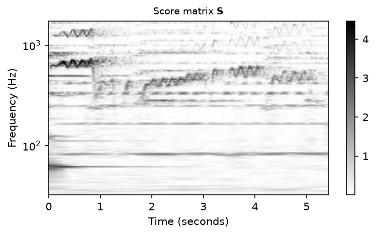
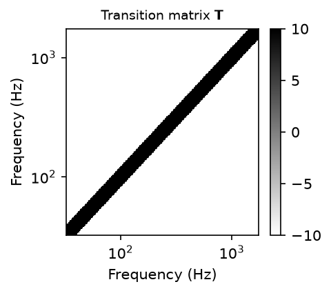
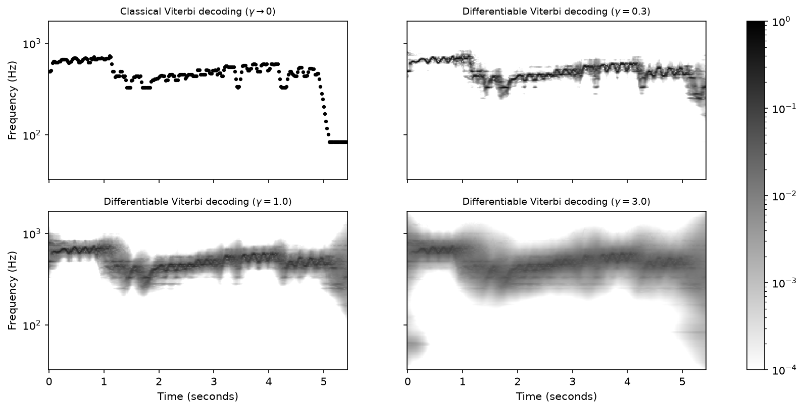

# dcrf: Linear-Chain CRFs with Differentiable Viterbi Decoding

[](LICENSE)

This is a Python package containing a Pytorch implementation of a linear-chain conditional random
field (CRF) with differentiable Viterbi decoding, referred to as dCRF module. This code accompanies
the following paper:

```bibtex
@inproceedings{StrahlZM26_dCRF_EUSIPCO,
  author    = {Sebastian Strahl and Johannes Zeitler and Meinard M{\"u}ller},
  title     = {On the Use of Differentiable {V}iterbi Decoding for Linear-Chain {CRFs}},
  booktitle = {Proceedings of the European Signal Processing Conference ({EUSIPCO})},
  address   = {Bruges, Belgium},
  pages     = {396--400},
  year      = {2026}
}
```

For details and references, please check out this paper.


## Installation

We recommend setting up a Python environment including Pytorch before installing `dcrf`. You may
use the [example environment](environment.yaml) provided as part of this package:

```bash
git clone https://github.com/groupmm/dcrf.git
cd dcrf
conda env create -f environment.yaml
conda activate dcrf
```

The environment already installs `dcrf` in editable mode. To install it into an existing
environment instead use:

```bash
pip install -e .
```


## Usage

```python
import torch

from dcrf import ToeplitzTransitions, dCRF

n_states, n_frames = 207, 500

# transition scores favoring small state changes between consecutive frames
diagonals = torch.full((2 * n_states - 1,), -10.0)
diagonals[n_states - 11 : n_states + 10] = 10.0

dcrf = dCRF(ToeplitzTransitions(n_states, diagonals=diagonals), gamma=1.0)

scores = torch.rand(1, n_frames, n_states)  # local scores, e.g. predicted by a network
theta = dcrf(scores)  # shape: (1, n_frames, n_states)
```

Passing `gamma=0.0` recovers the classical Viterbi algorithm, and `trainable=True` turns the
transition scores into learnable parameters. The decoder and the negative log-likelihood are also
available as plain functions operating on a `(batch, n_states, n_frames)` score matrix and a
transition matrix:

```python
from dcrf import differentiable_viterbi, nll
```

For more details, see [demo/demo.ipynb](demo/demo.ipynb), which reproduces Figure 1 of the paper.


## Demo

[demo/demo.ipynb](demo/demo.ipynb) applies a dCRF to a vocal melody extraction example.
The signal is a five-second excerpt of an opera recording, in
which a female singing voice with vibrato is present alongside orchestral accompaniment. A
log-compressed VQT spectrogram serves as score matrix **S**:



The hand-crafted transition matrix **T** favors small frequency changes between consecutive frames,
roughly reflecting the characteristics of an F0 trajectory:



Decoding **S** under this transition model yields the decoded sequence **Theta**. For a temperature
approaching zero, it is the one-hot encoded sequence found by the classical Viterbi algorithm.
Larger temperatures spread probability mass over competing sequences, which is what makes the
decoding differentiable:




## Tests

```bash
pip install -e ".[test]"
pytest
```


## Contribution
Automated code style checks via [pre-commit](https://pre-commit.com/):

```bash
pip install pre-commit
pre-commit install
pre-commit run --all-files
```


## License
This code is published under an [MIT license](LICENSE).


## Acknowledgements

This work was funded by the Deutsche Forschungsgemeinschaft (DFG, German Research Foundation) under
Grants No. 500643750 (MU 2686/15-1) and 521420645 (MU 2686/17-1). The authors are with the
[International Audio Laboratories Erlangen](https://audiolabs-erlangen.de/), a joint institution of
the [Friedrich-Alexander-Universität Erlangen-Nürnberg (FAU)](https://www.fau.eu/) and
[Fraunhofer Institute for Integrated Circuits IIS](https://www.iis.fraunhofer.de/en.html).
